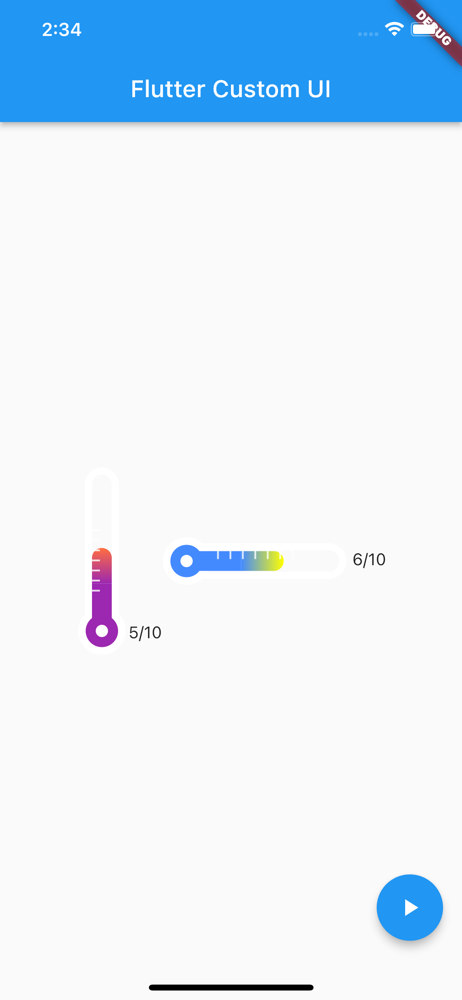

# flutter_custom_ui

"Flutter custom ui" is a custom widget that implements a thermometer gauge bar.

## Where to use

It can be used to show a certain mission or achievement rate.
For example, complete 10 missions of the day gauge 5/10.

- this is sample image.
  

## How to use

1. Enter the maximum gauge number and the current gauge number. (necessary)
* Enter the current gauge number not to exceed the maximum gauge number.

2. The current achievement count is displayed on the right side of the gauge bar. (Optional)
   Usage: showCountView: true (defalut: false)

3. For the gauge bar gradation color, input Color values from bottom to top and from left to right.
   (Optional, there is a default value.)
   Usage: gradientStartColor: Colors.blueAccent, gradientEndColor: Colors.yellowAccent,

4. Adjustable gauge bar up and down, left and right length and round size
   (option)

##### Sample code ([Source Code](/lib/sample/sample_code.dart))

